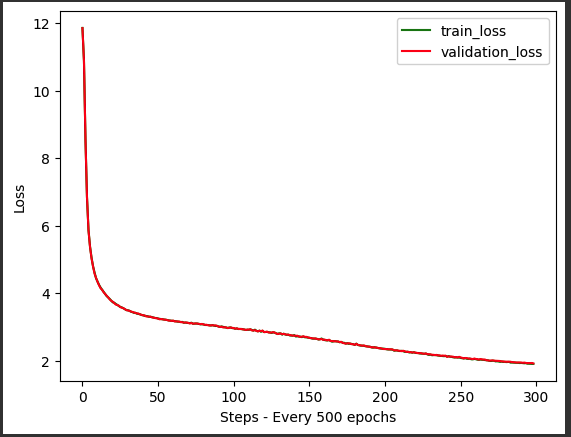

# Qwen3 TinyStories Language Model

A complete implementation of a Qwen3-based language model trained on the TinyStories dataset. This project demonstrates modern transformer architecture with Grouped Query Attention, SwiGLU activation, and Rotary Position Embeddings.

## Overview

This project implements a complete Qwen3-based language model training pipeline using the TinyStories dataset. The model features modern transformer optimizations including RMSNorm, Grouped Query Attention (GQA), SwiGLU FeedForward, and RoPE positional encoding.

## Key Features

- **Qwen3 Architecture**: Modern transformer with GQA, SwiGLU, and RMSNorm
- **Efficient Training**: Mixed precision training with gradient accumulation
- **Memory Optimized**: Uses memory mapping for large dataset handling
- **Text Generation**: Built-in generation capabilities with temperature and top-k sampling
- **Progress Monitoring**: Real-time training progress and loss visualization

## Model Specifications

| Parameter | Value |
|-----------|-------|
| **Model Size** | ~283M parameters |
| **Architecture** | Qwen3 with GQA, SwiGLU, RoPE |
| **Context Length** | 32,768 tokens |
| **Vocabulary** | 151,646 tokens (Qwen3 vocab) |
| **Layers** | 18 transformer blocks |
| **Attention Heads** | 4 heads with 1 KV group |
| **Hidden Dimension** | 640 |
| **Feed Forward** | 2,048 |

## Quick Start

### Prerequisites

```bash
pip install torch transformers datasets tiktoken tqdm matplotlib numpy
```

### Training the Model

1. **Clone the repository**
```bash
git clone https://github.com/ideaweaver-ai/qwen3-from-scratch
cd qwen3-from-scratch
```

2. **Run the training script**
```bash
python tiny_stories.py
```

3. **Monitor training progress**
   - Training will automatically save the best model as `qwen-slm.pt`
   - Loss curves will be displayed during training
   - Training typically takes 5-6 hours on a A4 GPU

### Generating Text

After training, you can generate text using the trained model:

```python
# Load the trained model
model = Qwen3Model(**QWEN3_CONFIG)
model.load_state_dict(torch.load("best_model_params.pt"))

# Generate text
prompt = "Once upon a time there was a pumpkin."
context = torch.tensor(tokenizer.encode(prompt, add_special_tokens=False)).unsqueeze(0)
generated = model.generate(context, max_new_tokens=200, temperature=0.8)
story = tokenizer.decode(generated.squeeze().tolist())
print(story)
```

## Architecture Details

### Core Components

#### RMSNorm
- Root Mean Square Normalization for stable training
- More efficient than LayerNorm with better gradient flow
- Used in modern models like LLaMA and Qwen

#### Grouped Query Attention (GQA)
- Memory-efficient attention mechanism
- Shares key-value pairs across multiple query heads
- Reduces memory usage while maintaining performance

#### SwiGLU FeedForward
- Advanced activation function using Swish-Gated Linear Units
- Superior to standard ReLU-based feedforward networks
- Used in PaLM, LLaMA, and other state-of-the-art models

#### Rotary Position Embedding (RoPE)
- Encodes positional information directly into attention
- No additional parameters required
- Better handling of long sequences

### Model Configuration

```python
QWEN3_CONFIG = {
    "vocab_size": 151646,  # Qwen3 vocabulary size
    "d_model": 640,        # Hidden dimension
    "n_heads": 4,          # Number of attention heads
    "n_kv_groups": 1,      # KV groups for GQA
    "n_layers": 18,        # Number of transformer layers
    "d_ff": 2048,          # Feed-forward dimension
    "max_seq_len": 32768,  # Maximum sequence length
    "dtype": torch.bfloat16, # Mixed precision
}
```

## Dataset

### TinyStories Dataset
- **Source**: `roneneldan/TinyStories` from Hugging Face
- **Size**: ~2.1 million training examples
- **Content**: Simple children's stories for language modeling
- **Format**: Plain text stories suitable for next-token prediction

### Data Processing
- **Tokenization**: Uses Qwen3 tokenizer with fallback to Qwen2.5
- **Memory Mapping**: Efficient binary storage for fast loading
- **Batch Processing**: Optimized for GPU training with memory pinning

## Training Configuration

### Hyperparameters
- **Learning Rate**: 1e-4 with cosine decay
- **Batch Size**: 32 with gradient accumulation (effective batch size: 1024)
- **Training Steps**: 150,000 iterations
- **Warmup Steps**: 1,000 linear warmup
- **Context Length**: 128 tokens per sequence
- **Mixed Precision**: bfloat16/float16 for memory efficiency

### Optimizer & Scheduler
- **Optimizer**: AdamW with weight decay (0.1)
- **Scheduler**: Linear warmup → Cosine annealing
- **Gradient Clipping**: Max norm of 0.5
- **Gradient Scaling**: For float16 stability

## Performance

### Training Metrics
- **Training Time**: ~5-6 hours on A4 GPU
- **Memory Usage**: ~8GB VRAM
- **Final Loss**: Typically 2.5-3.0 on TinyStories
- **Tokenization Time**: ~20 minutes for 2.1M examples

### Generated Text Quality
The model generates coherent, creative children's stories with good narrative flow and imaginative content.

**Example Output:**
> "Once upon a time there was a pumpkin. The pumpkin was very old and it was very lonely. It wanted life to feel like happening and needed others to follow it. One day, the pumpkin was walking down the street and it saw a store..."

## Technical Implementation

### Memory Optimization
- **Memory Mapping**: Uses `np.memmap` for efficient data loading
- **Gradient Accumulation**: Reduces memory footprint during training
- **Mixed Precision**: Automatic mixed precision for faster training

### Training Features
- **Automatic Checkpointing**: Saves best model based on validation loss
- **Progress Monitoring**: Real-time loss tracking and visualization
- **Device Detection**: Automatic GPU/CPU detection and optimization

## Training Results

The model shows excellent convergence with both training and validation loss decreasing steadily. The loss curves indicate good generalization with minimal overfitting.



**Google Collab link** : https://colab.research.google.com/drive/16IyYGf_z5IRjcVKwxa5yiXDEMiyf0u1d?usp=sharing

## 🚀 Usage Examples

### Basic Text Generation
```python
# Simple text generation
prompt = "The little girl walked into the forest and"
generated = model.generate(
    tokenizer.encode(prompt), 
    max_new_tokens=100, 
    temperature=0.8, 
    top_k=50
)
```

### Creative Story Writing
```python
# Generate creative stories
story_prompts = [
    "Once upon a time, there was a magical cat",
    "In a faraway kingdom, a brave knight",
    "The old wizard discovered a secret"
]

for prompt in story_prompts:
    story = generate_story(prompt, max_length=200)
    print(f"Prompt: {prompt}")
    print(f"Story: {story}\n")
```

## Development

### Project Structure
```
qwen3-tinystories/
├── tinystories_tokenizer.py    # Main training script
├── README.md                   # This file
├── requirements.txt            # Dependencies
├── train.bin                   # Tokenized training data
├── validation.bin              # Tokenized validation data
└── qwen3-slm.pt        # Trained model weights
```

### Dependencies
- `torch>=2.0.0` - PyTorch framework
- `transformers>=4.30.0` - Hugging Face transformers
- `datasets>=2.0.0` - Dataset loading and processing
- `tiktoken` - Tokenization utilities
- `tqdm` - Progress bars
- `matplotlib` - Plotting and visualization
- `numpy` - Numerical operations

## License

This project is open source and available under the [MIT License](LICENSE).

## Contributing

Contributions are welcome! Please feel free to submit a Pull Request. For major changes, please open an issue first to discuss what you would like to change.

## Support

For questions or support, please open an issue in the repository.

## Acknowledgments

- [TinyStories Dataset](https://huggingface.co/datasets/roneneldan/TinyStories) by Ronen Eldan
- [Qwen Models](https://huggingface.co/Qwen) by Alibaba Cloud
- [Hugging Face](https://huggingface.co/) for the transformers library

---

**Note**: This project is for educational and research purposes. The model is trained on the TinyStories dataset and is designed to generate simple children's stories.
